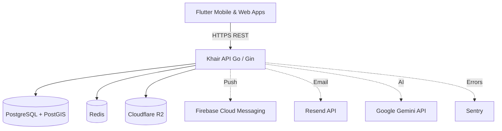

# Architecture

This document describes the current production topology and architecture of Khair.

## High-Level Topology

## Technology Stack

### Frontend
*   **Framework:** Flutter (Dart)
*   **Platforms:** Android, iOS, Web
*   **State Management:** BLoC
*   **Navigation:** go_router
*   **Mapping:** flutter_map (OpenStreetMap)

### Backend
*   **Language:** Go (1.24)
*   **Framework:** Gin Web Framework
*   **Database:** PostgreSQL 15+ with PostGIS for spatial queries
*   **Caching & Real-time:** Redis (Rate limiting, caching, SSE/WebSocket PubSub)
*   **Architecture:** Domain-Driven Design (DDD) inspired (Handler -> Service -> Repository)

### Infrastructure & External Services
*   **Hosting:** Dockerized, deployed on Render
*   **Object Storage:** Cloudflare R2 (S3-compatible API)
    *   `khair-public`: Publicly accessible bucket for event images, avatars.
    *   `khair-private`: Private bucket for sensitive organizer verification documents.
*   **Notifications:** Firebase Cloud Messaging (FCM HTTP v1 API)
*   **Transactional Email:** Resend
*   **AI Integration:** Google Gemini (used strictly on the backend for content moderation, categorization, and description generation)
*   **Observability:** Sentry for crash reporting and error tracking

## Core Domains

### 1. Auth (`internal/auth`)
Handles user registration, login, JWT issuance, and Google OAuth flow. Email verification is enforced using OTPs sent via Resend.

### 2. Events (`internal/event`, `internal/discovery`)
Core entity representing gatherings. Uses PostGIS for `nearby` queries. Supports complex filtering (date, category, city).

### 3. Organizers (`internal/organizer`, `internal/organizerapplication`)
Users who create events. They must go through an approval process. The application flow includes uploading documents to the private R2 bucket for admin review.

### 4. Admin (`internal/admin`)
Endpoints for platform moderators to approve/reject organizers and moderate events.

### 5. Media & Uploads (`internal/upload`, `pkg/storage`)
Handles multipart form uploads, validates MIME types and sizes, and pushes to Cloudflare R2.

### 6. AI (`internal/ai`)
Backend-side integration with Gemini. Generates event descriptions based on basic inputs, suggests categories, and performs content moderation before events go live.
